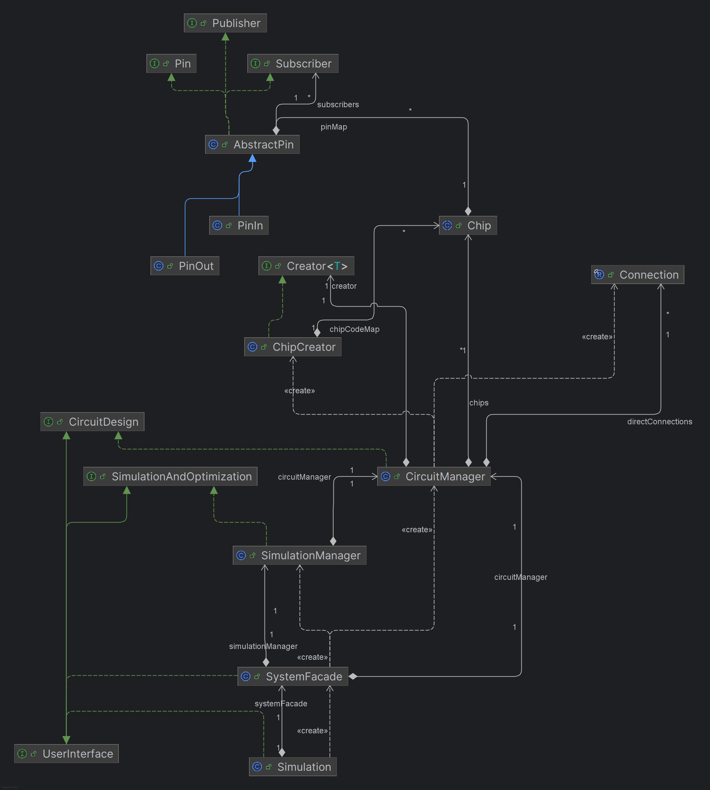

# Digital Logic Circuit Simulation

## Objective
The objective of the task was to create a simulation of a digital logic circuit, 
operating on LOW and HIGH states. The simulation involved combinational circuits, 
where outputs depend directly on input states, without state memory. It was also necessary 
to account for signal propagation time, which is constant for all circuits. An additional goal
was to optimize the circuit and test its correctness by removing unnecessary elements.

## Requirements

1. **Provide the `Simulation` class,** implementing the `UserInterface`.
2. **Use design patterns** and OOP best practices.
3. **Handle exceptions** as defined by the interface.

## `UserInterface`

The client interface is defined in the `edu.uj.po.simulation.interfaces` package.

### General Flow
1. **Create integrated circuits** with the ability to specify pins.
2. **Connect circuits** and link them to inputs/outputs.
3. **Declare the steady-state.**
4. **Set the steady-state.**
5. **Declare the initial state (moment 0).**
6. **Simulate/optimize** for a specified number of "ticks".

## Details

### Creating Integrated Circuits

The ability to create instances of integrated circuits, including the option to 
explicitly specify the pins of a given circuit. Using numerical pin naming is the
most convenient approach due to the different designations of inputs/outputs (e.g., A, B, Q, Q').

### Input and Output Headers

The ability to create a set number of abstract inputs through which the user can control the circuit. 
This refers to creating something similar to a multi-pin header (pin header), to which cables can 
be easily connected - example: [Pin header](https://en.wikipedia.org/wiki/Pin_header)  
The ability to connect circuit inputs with the pins of the input/output (depending on the user's or developer's perspective) header.  
A similar header can be created for observing the states of the circuit outputs.  
Additionally, it should be possible to connect circuit outputs to the pins of the output header.

### Circuit Connections

It is allowed to connect outputs to inputs (including multiple connections) as well as inputs 
to inputs. However, connecting multiple outputs together is not permitted. 
Additionally, the system must identify potential short circuits, which may occur 
recursively (indirectly), e.g., OUT -> IN -> IN -> OUT. 

**We** refers to IN, and **Wy** refers to OUT.
#### Connection Example

- **Red lines** indicate forbidden connections.
- **Green lines** indicate allowed connections.

### State Handling

The simulation operates with three states:
- `HIGH` – high state,
- `LOW` – low state,
- `UNKNOWN` – unknown state, occurring, for example, on unconnected pins.

The `UNKNOWN` state was introduced because many integrated circuits contain multiple 
elements (e.g., 4 NAND gates in a 7400 IC), and not all may be used. This situation is not an 
issue as long as the unused elements do not affect the program's results. However, if this state 
appears on elements actively participating in the simulation (i.e., they are connected in the circuit), 
it is considered an error and should trigger an appropriate exception. The exception should occur, 
for instance, when the output of a gate is observed or used, but one of its inputs is not connected.

### Steady State

The user defines the input states of the circuit.  
This state represents the overall condition of the circuit, set before the main simulation. Its purpose is to configure the circuit's pins to the correct state.  
It is required before each simulation or optimization to ensure accurate results.

### State at Moment "0"

This is the state set for the actual simulation on the input header(s).  
It is passed as a parameter to the simulation or optimization process.

### Simulation

The user defines the input states of the circuit at moment "0".  
Subsequent input states introduce changes, and the simulation shows the circuit's states over 
a specified number of clock "ticks".

### Optimization

It is necessary to identify and remove components that do not affect the simulation's outcome.

### Signal Propagation

Each circuit has the same signal propagation delay — 1 tick (this short sentence explains 
everything you need to know).  
Wires (connections) conduct electricity — meaning that a state change on any pin sets the 
same state on all connected pins.
---

## Implemented Circuits

| Circuit | Short Description           | Link                                                                                  |
|---------|-----------------------------|---------------------------------------------------------------------------------------|
| 74LS00  | 4x NAND                     | [74LS00 - description](https://eduinf.waw.pl/inf/prg/010_uc/7400.php)                 |
| 74HC02  | 4x NOR                      | [74HC02 - description](https://eduinf.waw.pl/inf/prg/010_uc/7402.php)                 |
| 74HC04  | 6x NOT                      | [74HC04 - description](https://eduinf.waw.pl/inf/prg/010_uc/7404.php)                 |
| 74HC08  | 4x AND                      | [74HC08 - description](https://eduinf.waw.pl/inf/prg/010_uc/7408.php)                 |
| 74HC10  | 3x NAND                     | [74HC10 - description](https://eduinf.waw.pl/inf/prg/010_uc/7410.php)                 |
| 74HC11  | 3x AND                      | [74HC11 - description](https://eduinf.waw.pl/inf/prg/010_uc/7411.php)                 |
| 74HC20  | 2x NAND                     | [74HC20 - description](https://eduinf.waw.pl/inf/prg/010_uc/7420.php)                 |
| 74LS31  | 6 delay elements            | [74LS31 - description](https://eduinf.waw.pl/inf/prg/010_uc/7431.php)                 |
| 74LS32  | 4x OR                       | [74LS32 - description](https://eduinf.waw.pl/inf/prg/010_uc/7432.php)                 |
| 74ALS34 | 6 buffers                   | [74ALS34 - description](https://eduinf.waw.pl/inf/prg/010_uc/7434.php)                |
| 74LS42  | BCD to 1 of 10 decoder      | [74LS42 - description](https://eduinf.waw.pl/inf/prg/010_uc/7442.php)                 |
| 74LS44  | GRAY code to 1 of 10 decoder | [74LS44 - description](https://eduinf.waw.pl/inf/prg/010_uc/7444.php)                |
| 7482    | Full two-bit adder          | [7482 - description](https://eduinf.waw.pl/inf/prg/010_uc/7482.php)                   |
| 74138   | 3-to-8 line decoder/demux   | [74138 - description](https://eduinf.waw.pl/inf/prg/010_uc/74138.php)                 |
| 74152   | 8-channel multiplexer       | [74152 - description](https://eduinf.waw.pl/inf/prg/010_uc/74152.php)                 |

### Note: The design does not take into account current-voltage characteristics.

## UML
